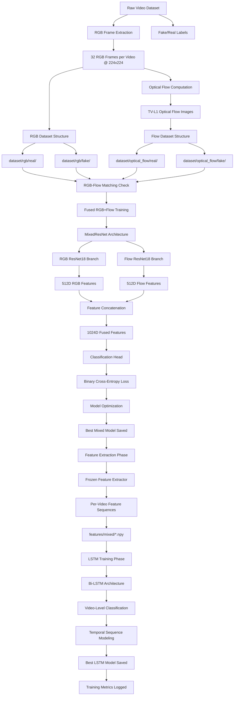
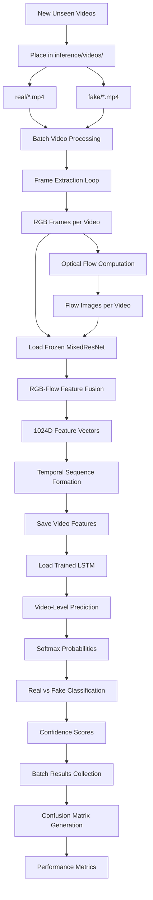
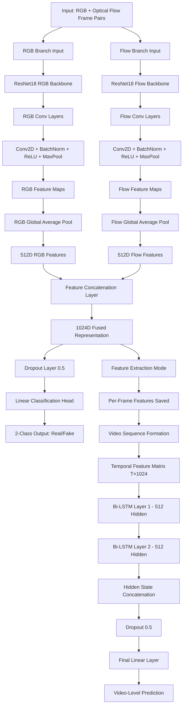
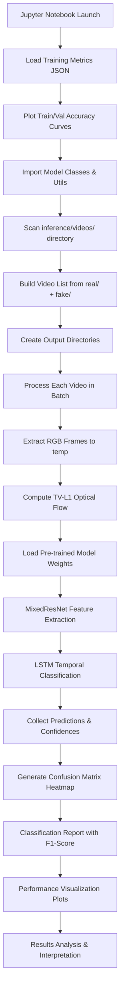
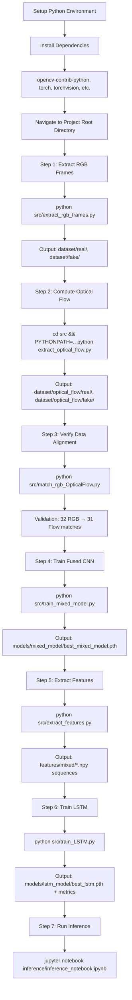
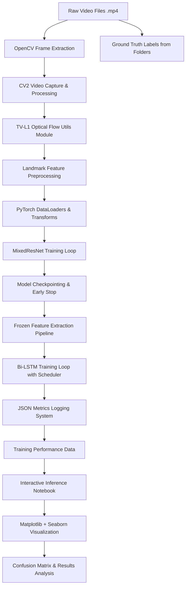
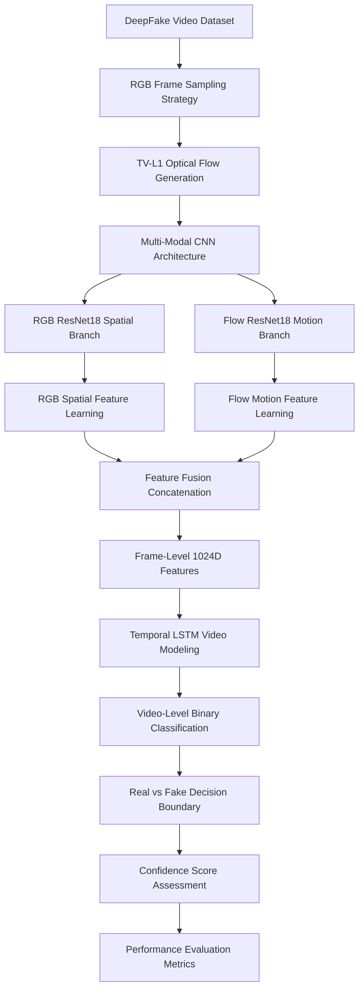
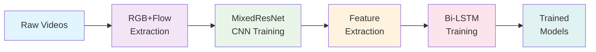
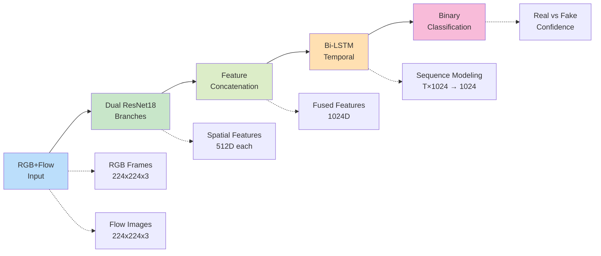
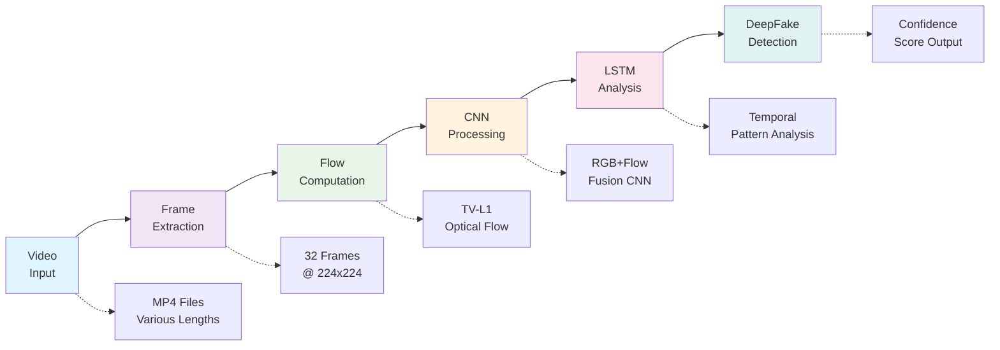

# 🎬 DeepFake Detection - Complete Workflow Diagram

## 📊 **TRAINING PIPELINE**



## 🔍 **INFERENCE PIPELINE**



## 🧠 **DETAILED MODEL ARCHITECTURE FLOW**



## 🔧 **DATA PREPROCESSING WORKFLOW**

```mermaid
graph TD
    A[Raw Videos in raw_videos/] --> B[real/ and fake/ folders]
    B --> C[extract_rgb_frames.py]
    C --> D[Frame Sampling Strategy]
    D --> E[Uniform 32 frames per video]
    E --> F[Resize to 224×224]
    F --> G[Save as JPG sequences]
    
    G --> H[extract_optical_flow.py]
    H --> I[Consecutive Frame Pairs]
    I --> J[TV-L1 Optical Flow Algorithm]
    J --> K[Flow Normalization & Clipping]
    K --> L[3-Channel Flow Images (x, y, magnitude)]
    L --> M[31 flow images per video]
    
    G --> N[match_rgb_OpticalFlow.py]
    M --> N
    N --> O[Frame-Flow Alignment Check]
    O --> P[Match Validation Report]
    P --> Q[Expected: 32 RGB → 31 Flow per video]
    
    Q --> R[Dataset Structure Ready]
    R --> S[Train/Val/Test Split]
    S --> T[Stratified Video-Level Split 70/20/10]
    T --> U[Frame-Level Data Loading]
```

## 📱 **INFERENCE NOTEBOOK WORKFLOW**



## 🎮 **COMPLETE TRAINING EXECUTION FLOW**



## 🔄 **SYSTEM COMPONENT INTERACTION**



## 🔄 **COMPLETE END-TO-END FLOW**



---

## 🎯 **SIMPLIFIED PRESENTATION WORKFLOW** 
*Perfect for slides and presentations*

### **Training Pipeline - Horizontal Flow**



### **Real-Time Inference Pipeline - Horizontal Flow**


### **Model Architecture - Essential Flow**



### **Data Flow - Core Components**



---

## 📋 **Key Workflow Stages Summary**

| Stage | Input | Process | Output | Duration |
|-------|-------|---------|--------|----------|
| **Data Preparation** | Raw videos | Frame extraction + Optical flow | RGB/Flow datasets | ~30 min |
| **CNN Training** | Frame pairs | ResNet18 dual-branch fusion | Frame-level classifier | ~2-4 hours |
| **Feature Extraction** | Trained CNN | Frozen feature extraction | Video sequences | ~15 min |
| **LSTM Training** | Feature sequences | Bi-LSTM temporal modeling | Video classifier | ~1-2 hours |
| **Inference** | New videos | End-to-end pipeline | Real/Fake predictions | ~5 min/video |
| **Evaluation** | Test results | Confusion matrix + metrics | Performance analysis | ~2 min |

---

## 🎯 **Critical Decision Points**

1. **Frame Sampling**: Fixed 32 frames → Uniform temporal coverage across video lengths
2. **Flow Algorithm**: TV-L1 → Accurate dense motion estimation between consecutive frames  
3. **CNN Architecture**: Dual ResNet18 → RGB spatial + Flow motion feature fusion
4. **Feature Fusion**: Concatenation → 1024D joint representation (512+512)
5. **Temporal Modeling**: Bi-LSTM → Forward + backward sequence classification
6. **Training Strategy**: CNN first, then LSTM → Staged learning for stability

## 📊 **DETAILED COMPONENT BREAKDOWN**

### **MixedResNet Architecture Details**
```python
# RGB Branch: ResNet18 → 512D features
# Flow Branch: ResNet18 → 512D features  
# Fusion: Concatenate(RGB, Flow) → 1024D
# Head: Dropout(0.5) → Linear(1024, 2) → Softmax
```

### **Bi-LSTM Configuration** 
```python
# Input: (Batch, Sequence_Length, 1024)
# LSTM: 2 layers, 512 hidden, bidirectional=True
# Output: Hidden states → Dropout(0.5) → Linear(1024, 2)
```

### **Training Hyperparameters**
| Parameter | MixedResNet | Bi-LSTM |
|-----------|-------------|---------|
| **Batch Size** | 8 | 16 |
| **Learning Rate** | 1e-4 | 1e-3 |
| **Epochs** | 12 | 30 |
| **Optimizer** | Adam | Adam |
| **Scheduler** | StepLR | ReduceLROnPlateau |
| **Early Stop** | 3 epochs | N/A |

---

## 📋 **Quick Reference - Key Technologies**

| Component | Purpose | Technology | Key Features |
|-----------|---------|------------|--------------|
| **OpenCV** | Video frame extraction | Computer Vision | TV-L1 optical flow, frame sampling |
| **TV-L1 Flow** | Motion detection between frames | Optical Flow Algorithm | Dense, accurate motion vectors |
| **ResNet18** | Spatial feature extraction | Convolutional Neural Network | Pre-trained, efficient, proven |
| **Bi-LSTM** | Temporal sequence modeling | Recurrent Neural Network | Forward+backward context |
| **PyTorch** | Deep learning framework | Machine Learning Platform | GPU acceleration, auto-grad |
| **Jupyter** | Interactive inference | Data Science Environment | Visualization, experimentation |

---

## 🏗️ **PROJECT STRUCTURE OVERVIEW**

```
DeepFake-Detection/
├── 📁 raw_videos/           # Input dataset
│   ├── real/*.mp4          # Authentic videos
│   └── fake/*.mp4          # DeepFake videos
├── 📁 dataset/             # Processed frames
│   ├── rgb/real/           # RGB frame sequences  
│   ├── rgb/fake/           # RGB frame sequences
│   ├── optical_flow/real/  # Flow image sequences
│   └── optical_flow/fake/  # Flow image sequences
├── 📁 src/                 # Training scripts
│   ├── extract_rgb_frames.py      # Step 1: Frame extraction
│   ├── extract_optical_flow.py    # Step 2: Flow computation
│   ├── match_rgb_OpticalFlow.py   # Step 3: Data validation
│   ├── train_mixed_model.py       # Step 4: CNN training
│   ├── extract_features.py        # Step 5: Feature extraction
│   └── train_LSTM.py              # Step 6: LSTM training
├── 📁 models/              # Saved model weights
│   ├── mixed_model/best_mixed_model.pth
│   └── lstm_model/best_lstm.pth
├── 📁 features/            # Extracted features
│   └── mixed/*.npy         # Video-level feature sequences
├── 📁 inference/           # Inference pipeline
│   ├── videos/real/        # Test videos (real)
│   ├── videos/fake/        # Test videos (fake)  
│   └── inference_notebook.ipynb   # Interactive inference
└── 📁 utils/               # Helper utilities
    └── optical_flow_utils.py      # Flow computation functions
```

---

## 🎯 **Performance Expectations**

### **Reported Accuracy**
- **Training Data (FF++)**: ~97% test accuracy
- **Unseen Data (CelebDF)**: ~80% cross-dataset accuracy
- **Architecture**: ResNet18 RGB + Optical Flow + Bi-LSTM

### **Computational Requirements** 
- **GPU Memory**: ~4-6GB VRAM for training
- **Training Time**: ~3-6 hours total pipeline
- **Inference Speed**: ~30 seconds per video (CPU)
- **Storage**: ~2-5GB for processed datasets

---

## 🎯 **One-Line Summary**
**Raw videos → RGB+Optical Flow extraction → Dual CNN spatial-temporal fusion → Bi-LSTM sequence modeling → DeepFake binary classification**

This comprehensive workflow represents the complete DeepFake Detection pipeline from raw video data to final real/fake classification with detailed technical specifications! 🚀

---

## 🔗 **Related Documentation**
- [Training Scripts Documentation](./src/)
- [Model Architecture Details](./models/)
- [Inference Examples](./inference/)
- [Utility Functions](./utils/)

---

*Last Updated: September 2025*
*Repository: DeepFake-Detection by Sainava*